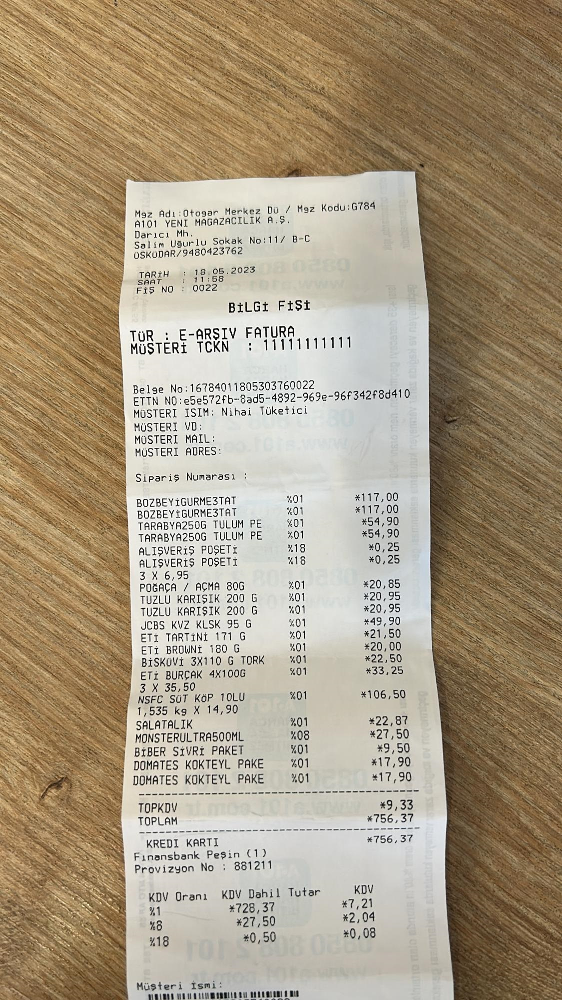
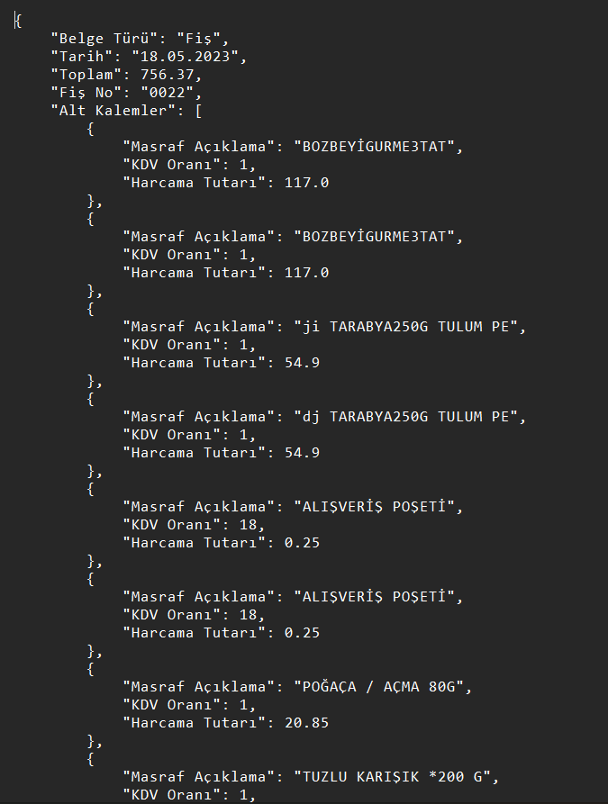

# Receipt OCR Pipeline

## Sample Results
Input Image             |  Output
:----------------------:|:----------------------:
  |  

## References

| Title                                                                                   | Author           | Year | Github                                                                                 | Paper                                                                                      | Download Model                                  |
| ----------------------------------------------------------------------------------------| ---------------- | ---- | -------------------------------------------------------------------------------------- | ----------------------------------------------------------------------------------------- | ------------------------------------------------|
| Autocrop: Smart receipt/bill cropping using deep learning                               | MetythornPenn    | 2025 | [autocrop_kh](https://github.com/MetythornPenn/autocrop_kh)                            | -                                                                                         | [autocrop_model_v2.pth](./models/autocrop_model_v2.pth) |
| Tesseract OCR                                                                           | Google           | 2006 | [tesseract-ocr](https://github.com/tesseract-ocr/tesseract)                            | [Paper Link](https://ieeexplore.ieee.org/document/5636142)                                | -                                              |


## Folder structure
```
├─ __pycache__/
├─ receipts/
├─ APEX_js/
├─ autocrop_kh/
├─ models/
│ └─ autocrop_model_v2.pth
├─ ocr_outputs/
├─ processed_receipts/
├─ uploads/
├─ processImage.py
├─ postProcess.py
├─ main.py
├─ results.txt
├─ results.png
├─ test.py
├─ ocr_api.py
├─ insert_to_db.py
├─ README.md
├─ requirements.txt
├─ ReceiptReader_v1.0.code-workspace
```

## Model Preparation

You need to create a folder named `models` in the root directory and place the pretrained autocrop model there:

- `models/autocrop_model_v2.pth` — Deep learning model for automatic cropping of receipts

Download the pretrained model from the repository or your internal storage.

## Requirements
You can setup the environment using pip
```
pip install -r requirements.txt
```

## How to Use as API

1. **Start the API Server:**
   ```bash
   python ocr_api.py
   ```
   This will start the OCR API on `http://localhost:5000/ocr`.

2. **Send an Image via POST Request:**
   - Using **cURL**:
     ```bash
     curl -X POST -F "image=@path_to_receipt.jpg" http://localhost:5000/ocr
     ```
   - Or via **Postman**:
     - Method: `POST`
     - URL: `http://localhost:5000/ocr`
     - Body: form-data
       - Key: `image` (type: File)
       - Value: Select your receipt image

3. **Receive JSON Response:**
   The API will return the OCR-extracted fields in JSON format, like:
   ```json
   {
     "Belge Türü": "Fiş",
     "Fiş No": "0392",
     "Tarih": "01.07.2025",
     "Toplam": 142.50,
     "Alt Kalemler": [
       {"Masraf Açıklama": "Ürün A", "KDV Oranı": 10, "Harcama Tutarı": 50.00},
       {"Masraf Açıklama": "Ürün B", "KDV Oranı": 18, "Harcama Tutarı": 92.50}
     ]
   }
   ```


## Creators
[**Yusuf Bedri Bitiren**](https://github.com/Yusuf-Bedri-Bitiren)
[**Yaman Türköz**](https://github.com/Yaman-Turkoz)
